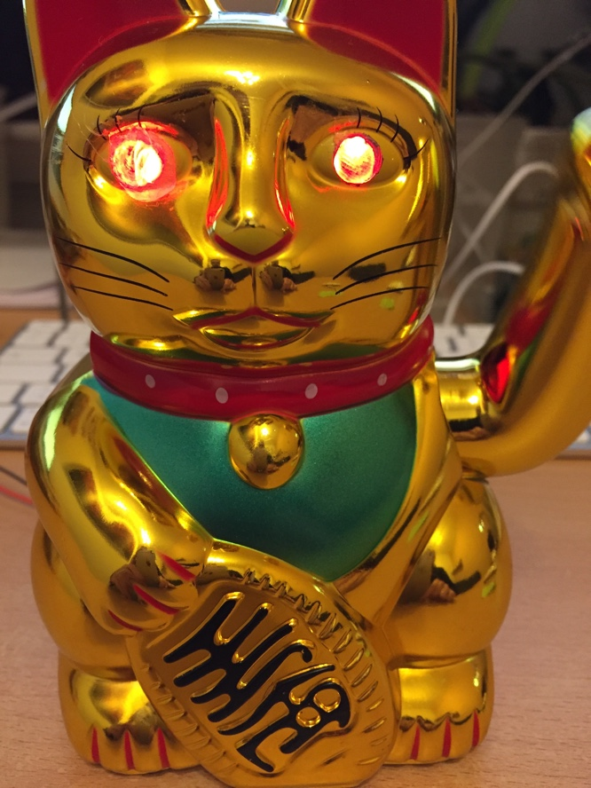

# How to build a Winkekatze

## Projects
- <https://github.com/themad/jimmykater>
- <https://github.com/jalmeroth/FelixTheCat>

## Parts

### LEDs (WS2812)
- <http://www.watterott.com/de/WS2812-8mm-LED>
- <https://github.com/watterott/WS2812-Breakout/blob/master/hardware/WS2812LED.pdf>