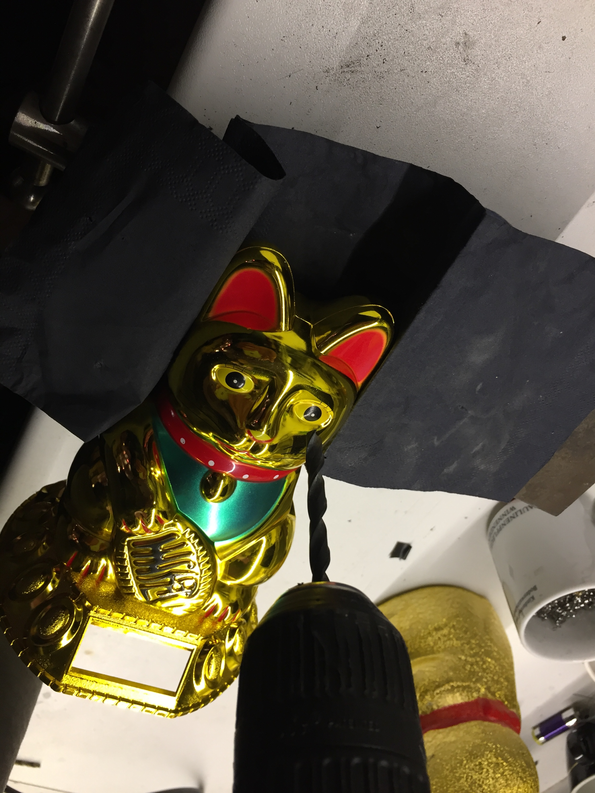

# How to build a Winkekatze

## Winkekatze Projects
- <https://github.com/themad/jimmykater>
- <https://github.com/jalmeroth/FelixTheCat>

## Required parts

### The cat (Maneki Neko)
- <http://www.ebay.de/usr/toolz-4-you>

### ESP8266
- <https://www.itead.cc/esp-12f.html>
- <https://www.aliexpress.com/item/Free-Shipping-10PCS-LOT-ESP8266-serial-WIFI-module-adapter-plate-Applies-to-ESP-07-ESP-08/32473289025.html>

### Servo motor
- Get a motor from eBay or AliExpress

### LEDs (WS2812)
- <http://www.watterott.com/de/WS2812-8mm-LED>
- <https://github.com/watterott/WS2812-Breakout/blob/master/hardware/WS2812LED.pdf>

### Other parts
- Diode
- Jack-Connector
- Barrel-Jack
- USB-Cable

## Step-by-step Guide
1.  Get all [required parts](#required-parts) and familiarize with what you have got there.

    
    

2.  `<this step is intentially left blank>`

3.  Open the case and remove the buttom

    
    
    

4.  Remove the arm carefully

    
    
    

5.  Remove the servo motor

    
    
    
    

6.  Open your eyes

    
    
    

7.  Solder LEDs to prototyping board, matching spacing of the eyes

    
    
    

8.  Get lucky.